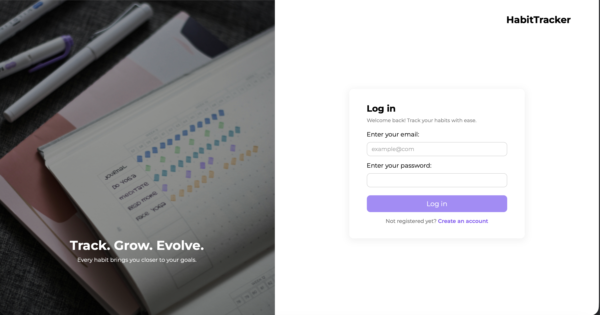
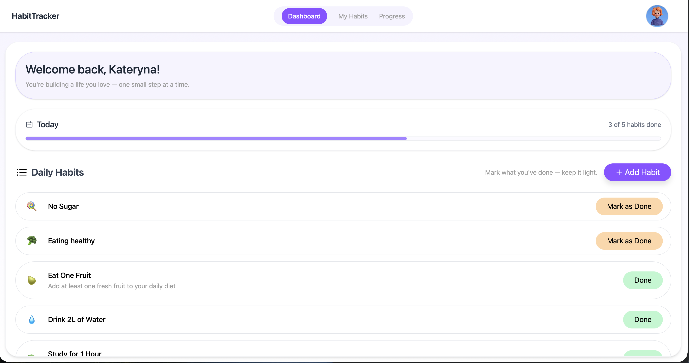
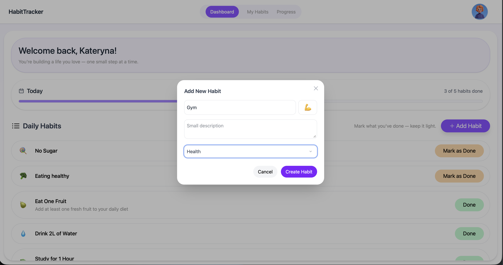
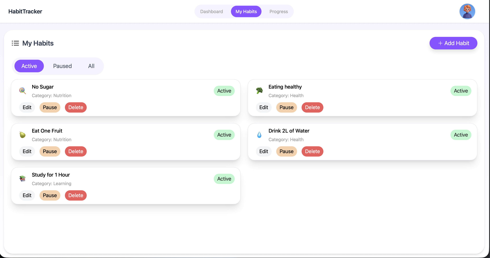
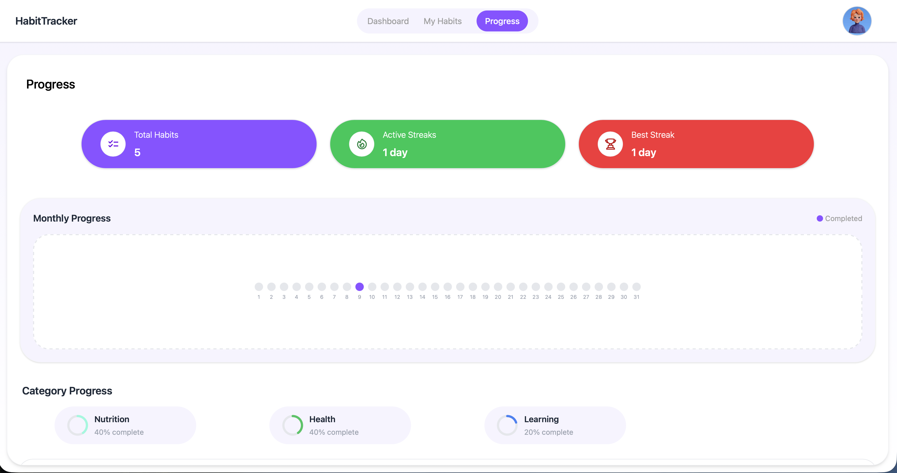
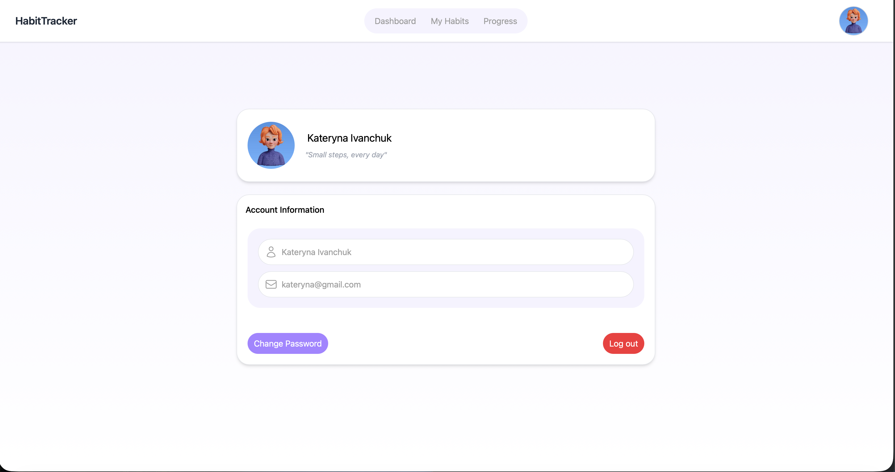

# Habit Tracker

Habit Tracker is a web application built with **Spring Boot**, **Thymeleaf**, and **Gradle** for tracking daily habits and monitoring progress.

The application allows users to manage their habits, track completion statistics, and visualize their daily progress through a dashboard.

---

## Features

* User authentication and login
* Dashboard displaying habit progress
* Create, edit, delete, pause, and resume habits 
* Profile page with image upload
* Secure access configuration using Spring Security
* Server-side rendered HTML using Thymeleaf templates

---

## Tech Stack

* **Java**
* **Spring Boot**
* **Spring MVC**
* **Spring Security**
* **Thymeleaf**
* **Gradle**
* **HTML / CSS / JavaScript**

---

## Application Screenshots

  

  

  
  

  
  

---

## Author

Kateryna Ivanchuk
